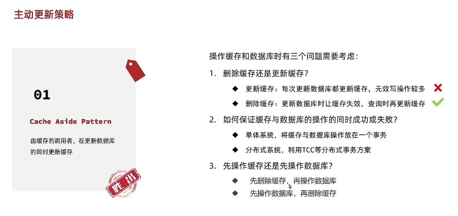
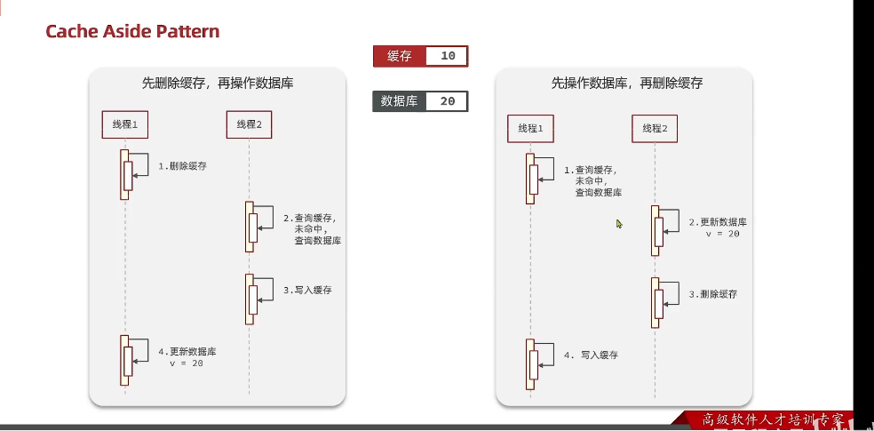
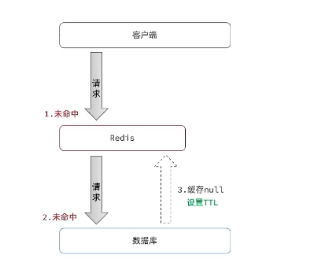
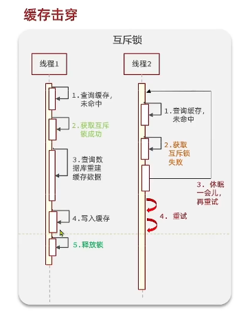
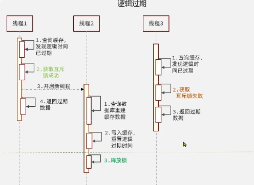
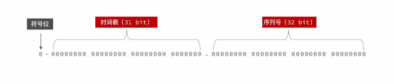
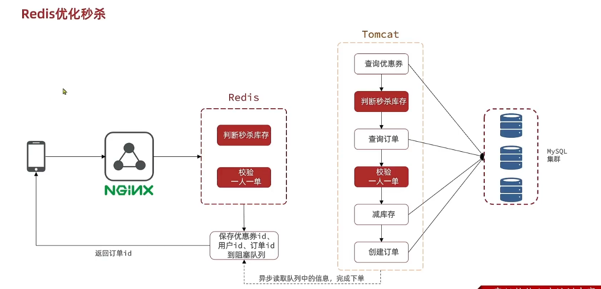
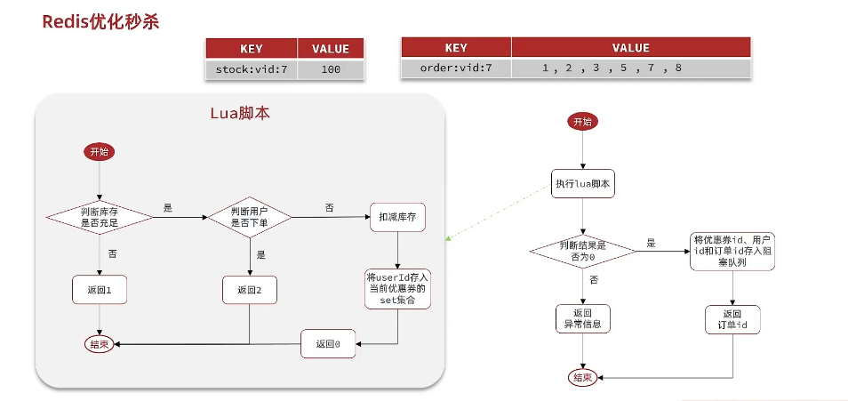
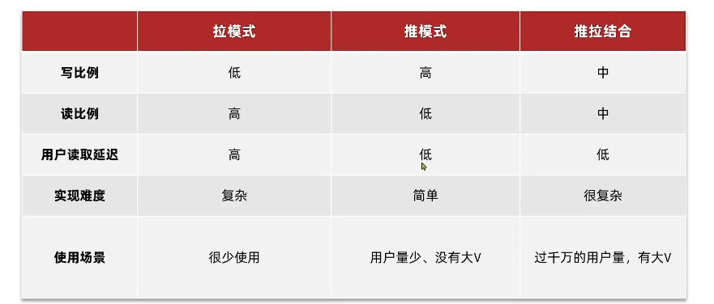
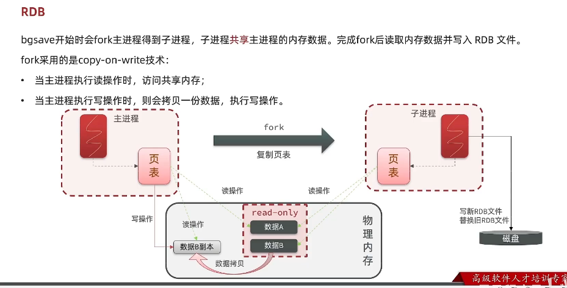

### 缓存更新策略

1. 内存淘汰，由redis的过期策略来更新缓存，缓存过期后，下次访问时，从数据库中获取数据，然后更新缓存
2. 主动更新，由应用程序来更新缓存，应用程序定时更新缓存，或者应用程序在更新数据库时，更新缓存
    1. 缓存调用者去更新缓存
    2. 缓存和数据库整合为一个服务，由服务来进行维护一致性
       
       
    3. 调用者只操作缓存，由其他线程异步去将缓存数据持久化到数据库
3. 超时剔除

### 缓存穿透

缓存穿透是指查询一个一定不存在的数据，由于缓存是不命中时才会去数据库查询，所以不存在的数据会一直去数据库查询，导致数据库压力过大。
常用的解决方案：

1. 布隆过滤器，将所有可能存在的数据哈希到一个足够大的bitmap中，一个一定不存在的数据会被这个bitmap拦截掉，从而避免了对底层存储系统的查询压力。
    1. 优点：内存占用少
    2. 缺点：有一定的误判率和删除困难
2. 缓存空对象，当缓存中没有数据时，将空对象缓存起来，下次查询时，直接返回空对象，避免了对底层存储系统的查询压力。
    1. 缓存空对象时，需要设置一个过期时间，防止缓存雪崩。
    2. 可能会造成短期的不一致。

### 缓存雪崩

缓存雪崩是指缓存中的数据在同一时间过期或者redis服务宕机，导致大量的请求直接打到数据库上，造成数据库压力过大。
常用的解决方案：

1. 设置不同的过期时间，防止缓存同时过期
2. 设置热点数据永不过期
3. 限流降级，当缓存失效时，限制对数据库的访问，降低数据库的压力
4. 服务降级，当缓存失效时，直接返回空对象，避免了对底层存储系统的查询压力。
5. 给业务增加多级缓存，当缓存失效时，先从二级缓存中获取数据，如果二级缓存中没有数据，再从数据库中获取数据，然后更新缓存。

### 缓存击穿

缓存击穿问题也叫热点key问题，就是一个被高并发访问并且缓存重建业务较复杂的key突然失效了，无数的请求访问这个key，都会去数据库中查询，造成数据库压力过大。
常用的解决方案：

1.
互斥锁，当缓存失效时，加锁，防止多个线程同时去数据库中查询数据，然后更新缓存。
    1. 性能差，大部分线程均需要等待一个线程去数据库中查询数据，然后更新缓存。
2. 逻辑过期时间，当缓存失效时，设置一个逻辑过期时间，当逻辑过期时间到达时，再去数据库中查询数据，然后更新缓存。
   

### 全局唯一ID

1. 数据库自增ID
    - ID规律性强，容易被猜测
    - ID长度受限于数据库字段类型
2. 全局ID生成器
    - 优点：ID长度不受限于数据库字段类型，ID规律性弱
      
      格式如下:
      

### 超卖等线程安全问题解决方案

1. 悲观锁：添加同步锁，让线程串行执行

- 优点：简单粗暴
- 缺点：性能差，大部分线程均需要等待一个线程执行完毕

2. 乐观锁：使用CAS算法，让线程并行执行，在更新时候判断是否有其他线程在修改数据，如果有则重试，直到成功为止

- 优点：性能好
- 缺点：重试次数过多，会影响性能（可以通过判断库存是否大于0来减少重试次数）

### 分布式锁

分布式锁；满足分布式系统或集群模式下多进程可见并且保证互斥
最大的特点：互斥性，同一时间只有一个线程可以执行临界区代码

#### 分布式锁实现


- 基于redis的分布式锁
  实现分布式锁需要实现的两个基本方法：
- 获取锁：
    - setnx：当key不存在时，设置key的值为value，返回1；当key存在时，不设置key的值，返回0
    - expire：设置key的过期时间
      当redis服务所在的机器宕机时，会出现死锁，所以需要设置过期时间，防止死锁
      但是需要避免在设置锁和设置过期时间之间出现宕机，所以需要将两个操作合并成一个原子操作
      ``set lock thread1 EX 10 NX(设置锁的过期时间为10秒，当key不存在时，设置key的值为thread1，返回1；当key存在时，不设置key的值，返回0)``
    - 采用非阻塞式的方法去获取锁，当获取锁失败时，可以重试，直到获取锁成功为止
- 释放锁：
    - 手动释放 ``del thread1``
    - 超时释放
      

#### 分布式锁可能会出现的问题

由于业务代码线程阻塞的时间过长，导致redis分布式锁到期释放，其他线程获取到锁，导致业务代码重复执行

解决方法：释放锁的时候，判断锁是否是自己的，如果是自己的，则释放锁，否则不释放锁

- 改进redis分布式锁

1. 在获取锁时存入线程标识
2. 在释放锁时判断锁是否是自己的

#### 分布式锁优化

目前存在的问题

1. 不可重入：同一个线程在没有释放锁之前，不能再次获取锁。当线程在执行A方法时，获取到锁，然后在A方法中调用B方法，B方法也需要获取锁，但是由于锁已经被A方法获取，所以B方法获取锁失败，导致B方法无法执行。
   解决：通过借助哈希数据结构来实现可重入锁
    2. 不可重试：获取锁只尝试一次就返回false，没有重试机制
       解决：获取锁时，在重试时间内，借助订阅和信号量机制避免无限制重试，占用cpu
        ```
       if (ttl >= 0L && ttl < time) {
        ((RedissonLockEntry)subscribeFuture.getNow()).getLatch().tryAcquire(ttl, TimeUnit.MILLISECONDS);
         } else {
             ((RedissonLockEntry)subscribeFuture.getNow()).getLatch().tryAcquire(time, TimeUnit.MILLISECONDS);
         }
   ```
3. 超时释放
   利用watchDog，每隔一段时间（releaseTime/3）去检查锁是否过期，如果过期则释放锁
    ```
    private void scheduleExpirationRenewal(long threadId) {
        if (lockWatchdogTimeout > 0) {
            lockExpirationTask = redisson.getCommandExecutor().schedule(new Runnable() {
                @Override
                public void run() {
                    renewExpiration();
                }
            }, lockWatchdogTimeout, TimeUnit.MILLISECONDS);
        }
    }
    ```
4. 主从一致性：如果redis提供了主从集群，主从同步存在延迟，此时主节点发生了宕机，如果从并同步中的锁数据还未同步到从节点，此时从节点会被选举为主节点，导致锁数据丢失
    - 借助multiLock联锁机制，将多个锁绑定在一起，只有当所有可重入锁都获取成功时，才算获取成功

```
    RLock lock1 = redisson.getLock("lock1");
    RLock lock2 = redisson.getLock("lock2");
    RLock lock3 = redisson.getLock("lock3");
    RedissonMultiLock lock = new RedissonMultiLock(lock1, lock2, lock3);
```

借助redisson框架解决以上问题，没有必要自己实现锁，直接使用redisson框架提供的锁即可

### 秒杀业务优化

原本业务需要通过tomcat进行库存判断和一人一单，但这样导致业务速度变慢，所以需要将库存判断和一人一单放到redis中，通过异步获取消息队列中的消息进行处理

通过lua脚本实现库存判断和一人一单

- 优化
    - 新增秒杀优惠券的同时，将优惠券信息保存到redis中
    - 基于lua脚本，判断秒杀库存，一人一单，决定用户是否抢购成功
    - 如果抢购成功，将优惠券信息和用户id封装后放入阻塞队列中
    - 开启线程任务，不断从阻塞队列中获取信息，实现异步下单功能
      

#### 基于阻塞队列的异步秒杀存在哪些问题

- 内存限制问题。 阻塞队列中的数据是在内存中的，如果阻塞队列中的数据过多，会导致内存溢出
- 数据安全问题。

#### 基于PubSub的消息队列

- 优点：采用发布订阅模式，支持多生产多消费
- 缺点：
    - 不支持消息持久化
    - 无法避免消息丢失。当发布者下线时，无法收到消息，导致消息丢失
    - 消息堆积有上线，超出时数据丢失

#### 基于Stream的消息队列

Stream是一种新的数据类型，支持持久化，可以实现一个功能完善的消息队列。

```

  XADD key [NOMKSTREAM] [MAXLEN|MINID [=|~] threshold [LIMIT count]] *|id field value [field value ...]
  summary: Appends a new entry to a stream
  since: 5.0.0
  group: stream
  
  NOMKSTREAM: Don't create the stream if it does not exist.
  id:消息的唯一id，*表示自动生成，格式为时间戳+递增数字，例如：1600000000001-0
  filed:消息的key
   value:消息的value
   
   简单示例：XADD mystream * name jack //向mystream中添加一条消息，id为自动生成，key为name，value为jack
   
   
   XREAD [COUNT count] [BLOCK milliseconds] STREAMS key [key ...] ID [ID ...]
   COUNT：表示一次读取的消息数量
    BLOCK：表示阻塞时间，当没有消息时，阻塞时间到了，会返回空
    STREAMS：表示一次读取多个stream的消息
    ID：表示读取的起始id，如果是*表示从最新的消息开始读取，如果是0-0表示从最早的消息开始读取
    
    简单示例：XREAD COUNT 2 STREAMS mystream 0-0 //从mystream中读取2条消息，从最早的消息开始读取
    XREAD COUNT 2 STREAMS mystream $ //从mystream中读取2条消息，从最新的消息开始读取
    XREAD COUNT 1 BLOCK 1000 STREAMS mystream 0-0 //从mystream中读取1条消息，从最早的消息开始读取，如果没有消息，阻塞1秒，如果还没有消息，返回空
    通过这种方式，循环调用XREAD BLOCK，可以实现阻塞队列的功能
```

注意：当我们指定起始ID为$时，代表读取最新的消息，如果我们处理一条消息的过程中，又有超过1条以上的消息到达队列。则下次获取时也只能获取到最新的一条，会出现漏读消息的问题。
特点：

- 消息可持久化
- 消息可以被多个消费者读取
- 消息可以阻塞读取
- 消息有漏读的风险

#### 消费者组

消费者组：将多个消费者划分到一个组中，监听同一个队列。具备下列特点：

- 消息分流：队列中的消息会分流给组内的不同消费者，而不是重复消费，从而加快消费处理的速度
- 消息标识：消费者组会维护一个标示，记录最后一个被处理的消息，哪怕消费者宕机重启，还会从标示之后读取消息，确保每一个消息都会被消费。
- 消费确认：消费者获取消息后，消息确认pending状态，并存入一个pending-list。当处理完成后需要通过XACK命令将消息确认为delivered状态，从而从pending-list中删除。

```
XGROUP CREATE key groupname ID [MKSTREAM]
key：队列名称
groupname：消费者组名称
ID：表示消费者组的标示，如果是0-0表示从最早的消息开始消费，如果是$表示从最新的消息开始消费
MKSTREAM：表示如果队列不存在，是否创建队列

其他常见命令
# 删除指定的消费者组
XGROUP DESTROY key groupname

# 给指定的消费者组添加消费者
XGROUP CREATECONSUMER key groupname consumername

# 删除指定消费者组中的指定消费者
XGROUP DELCONSUMER key groupname consumername

# 从消费者组读取消息
XREADGROUP GROUP groupname consumername COUNT count [BLOCK millseconds] [NOACK] STREAMS key [key ...] ID [ID ...]
count：表示一次读取的消息数量
millseconds：表示阻塞时间，当没有消息时，阻塞时间到了，会返回空
NOACK：表示不需要确认消息
>:表示从最新的消息开始读取

简单示例：XREADGROUP GROUP group1 consumer1 COUNT 1 STREAMS mystream 0-0 //从mystream中读取1条消息，从最早的消息开始读取，如果没有消息，阻塞1秒，如果还没有消息，返回空


# 消息确认
XACK key groupname ID [ID ...]
简单示例：XACK mystream group1 1600000000001-0 //将1600000000001-0消息确认为已消费
```


### 关注推送

关于推送也叫Feed流，是一种消息推送的方式，可以实现类似微博、抖音、微信朋友圈的功能。为用户持续的提供沉浸式的体验，通过无限下拉刷新获取新的消息。

#### Feed流的模式

- Timeline: 不做内容筛选，简单按照内容发布时间排序，常用于好友或关注，例如微博、微信朋友圈
  实现方案 
    - 拉模式：也叫做读扩散。 
        - 优点：实现简单，不需要额外的存储空间
        - 缺点：当用户关注的人很多时，需要拉取的消息很多，会影响性能。延迟高
    - 推模式：也叫做写扩散。 
        - 优点：性能高，延迟低
        - 缺点：实现复杂，由于需要写n份推送，需要额外的存储空间
    -
    推拉结合模式，也叫做读写模式。对于活跃粉丝直接采用推模式，但对于普通粉丝来说，从博主的发件箱中拉取信息，采用拉模式。 

- Recommendation: 根据用户的兴趣爱好，推荐相关的内容，例如抖音、今日头条

#### Feed流的分页问题

Feed流中的数据会不断更新，所以数据的角标也在变化，因此不能采用传统的分页模式。
比如数据库中存在6，5，4，3，2，1数据，第一次分页取出6，5，4，此时插入一条新数据7，第二次分页由于数据角标发生改变，就会取出4，3，2数据。
因此采用滚动分页模式。

- 滚动分页模式：每次获取指定数量的数据，下次获取时，从上次获取的最后一条数据开始获取。
  这种模式获得的数据 ZREVRANGEBYSCORE z1 1000(MAX) 0(MIN) WITHSCORES LIMIT 0 3 -> 6,5,4
  下次获取的数据 ZREVRANGEBYSCORE z1 4(MAX) 0(MIN) WITHSCORES LIMIT 1 3 -> 3,2,1 (4就是上一次查询的最小值)
  

滚动分页查询参数：
1.MAX 当前时间戳 || 上一次查询最小值
2.MIN 固定为0
3.OFFSET 0 || 上一次查询的结果中，与最小值相同的数据的数量
4.LIMIT 每次查询的数量 固定值

### 附近商户搜索

按照商户类型做分组，类型相同的商户作为同一组，以typedId为key存入同一个GEO集合中即可。
例如:shop:geo:food、shop:geo:hotel、shop:geo:movie

### 分布式缓存

#### RDB持久化

RDB持久化是将内存中的数据以快照的形式写入到磁盘中，是一种全量备份的方式。在redis.conf中配置

```
# 持久化策略
save 900 1 # 900秒内至少有1个key发生变化，就会触发持久化操作
save 300 10 # 300秒内至少有10个key发生变化，就会触发持久化操作
save 60 10000 # 60秒内至少有10000个key发生变化，就会触发持久化操作
# 持久化文件名
dbfilename dump.rdb
# 持久化文件存放路径
dir ./
```

bgsave开始时会fork主进程得到子进程，子进程共享主进程的内存数据，完成fork后读取内存数据并写入RDB文件。

fork采用的是copy-on-write机制，即子进程在修改数据时，会先复制一份数据，然后再修改，这样就不会影响到主进程的数据。执行读操作时，会访问共享内存。

#### AOF持久化

AOF持久化是将内存中的数据以日志的形式写入到磁盘中，是一种增量备份的方式。在redis.conf中配置

```
# AOF持久化开关
appendonly yes
# AOF持久化文件名
appendfilename "appendonly.aof"
# AOF持久化文件存放路径
dir ./
# AOF持久化策略
appendfsync always # 每次写入都会触发fsync，效率最低，但是保证数据不丢失
appendfsync everysec # 每秒触发一次fsync，效率较高，但是可能会丢失1秒的数据
appendfsync no # 由操作系统决定何时触发fsync，效率最高，但是可能会丢失1秒以上的数据
```

因为是记录命令，AOF文件会比RDB文件大得多，而且AOF会记录对同一个key的多次写操作，但只有最后一次写操作是有效的，因此AOF文件会越来越大。通过执行bgrewriteaof命令，可以将AOF文件重写，重写后的AOF文件只会保留对同一个key的最后一次写操作，用最少的命令达到相同效果。

#### RDB和AOF的选择


### Redis主从架构

单节点redis的并发能力有限，为了提高并发能力，可以采用主从架构。主从架构中，主节点负责写操作，从节点负责读操作，主节点将写操作同步到从节点，从节点将读操作同步到主节点。而这也是redis选择主从结构的原因。


#### 数据同步原理

主从第一次同步是全量同步。
master向slave请求数据同步，slave执行replicaof命令建立连接。
master判断是否第一次同步，是第一次，返回master的数据版本信息。
slave保存版本信息。


** master如何判断slave是否第一次同步 **

- replication id：简称replid，是数据集的标记。id一致则说明是统一数据集，每个master都有唯一的replid，slave则会继承master的replid。如果id不一致，则说明是不同的数据集，需要全量同步。
- offset：偏移量，随着记录再repl_baklog中的增加而增加,slave完成同步时也会记录当前同步的offset。如果slave的offset小于master的offset，则说明slave落后于master，需要更新。
  因此slave做数据同步，必须向master声明自己的replid和offset，master根据slave的replid和offset判断是否需要全量同步。

注意：repl_baklog大小有上限，写满后会覆盖最早的数据，如果slave断开时间过久，导致数据被覆盖，则无法实现增量同步，只能再次全量同步。
可以从以下几个方面来优化redis主从集群

- 在master中配置repl-diskless-sync yes，slave在第一次同步时，master不会将数据写入磁盘，而是直接发送给slave，减少磁盘IO，提高效率。
- redis单节点内存占用不要太大，减少RDB导致的过多磁盘io。
- 在master中配置repl-backlog-size，增大repl_baklog的大小，或者发现slave宕机时尽快实现故障恢复，减少数据被覆盖的可能性。
- 限制一个master的slave节点数量，如果实在有很多slave，则可以采用主-从-从链式结构，减少master压力。

#### 服务状态监控

Sentinel基于心跳机制检测服务状态，每个1秒向集群的每个实例发送ping命令：

- 主观下线：如果sentinel在指定时间内没有收到实例的回复，则认为实例主观下线。
- 客观下线：如果超过指定数量的sentinel认为实例主观下线，则认为实例客观下线。这个值最好超过sentinel的数量的一半，否则可能出现脑裂。

#### 选举新的master

当master主观下线后，sentinel会从剩余的slave中选举一个新的master，选举的原则如下：

- 首先判断slave节点与master节点断开时间长短，如果超过指定值，则不考虑该slave。
- 然后判断slave的slave-priority值，越小优先级越高，如果是0，则不考虑该slave。
- 判断slave的offset，越大说明数据越新，优先级越高。
- 如果有多个slave满足上述条件，则选择runid最小的slave作为新的master。

#### 故障转移

当选中了其中一个slave作为新的master后，需要将其他slave切换到新的master上，这个过程叫做故障转移。
故障转移的步骤如下：

- sentinel向master发送slaveof no one命令。
- 向其他所有slave节点发送slaveof newmaster命令,让这些slave成为新的master的从节点，开始从新的master上面同步数据。
- sentinel将故障节点标记为slave，当故障节点恢复后，会成为新的master的从节点。

### 分片集群

主从和哨兵可以解决高可用、高并发读的问题。但是依然有两个问题没有解决：

- 海量数据存储问题
- 高并发写的问题
  使用分片集群可以解决上述问题，分片集群特征:
- 集群中有多个master节点，每个master节点负责一部分数据。
- 每个master都可以有多个slave节点
- master节点之间通过ping检测彼此健康状态
- 客户端请求可以访问集群任意节点，最终都会转发到正确节点
  

#### 散列插槽

Redis会把每一个master节点映射到0-16383个槽位，每个槽位对应一个数据片段，每个master节点负责一部分槽位，每个槽位只属于一个master节点，这样就实现了数据的分片。
数据key不是与节点绑定，而是与插槽绑定。redis会根据key的有效部分计算插槽值，分两种情况：

- key中包含{}，则{}中的内容作为key的有效部分，计算插槽值。
- key中不包含{}，则key的全部作为有效部分，计算插槽值。
  例如：key是num，那么就根据num计算。如果是{soxhwhat}num,则根据soxhwhat计算。计算方式是crc16算法得到一个hash值，然后对16384取模，得到一个槽位值。
- Redis 如何判断某个key在哪个实例
    - 将16384个插槽分配到不同的实例
    - 根据key的有效部分计算哈希值，对16384取余
    - 余数作为插槽，寻找slot所在实例
- 如何将同一类数据固定的保存在同一个redis实例中
    - 同一个类商品前缀使用相同的有效部分，例如key都以{keyid}为前缀

### 多级缓存

#### 传统缓存的问题

传统的缓存策略一般是请求到达tomcat后，先查询redis，如果redis中没有，则查询mysql，然后将查询结果写入redis，下次请求就可以直接从redis中获取。
这种方式存在以下问题：

- 请求要经过tomcat处理，tomcat的性能成为整个系统的瓶颈
- redis缓存失效时，会导致大量请求直接访问mysql，造成mysql压力过大

#### 多级缓存方案

多级缓存方案是将缓存分为多个层级，每个层级都有自己的缓存策略，请求到达时，先查询最上层的缓存，如果没有命中，则查询下一层缓存，直到最后一层缓存。


#### 本地进程缓存Caffine

基本使用

```
        Cache<String, String> cache = Caffeine.newBuilder()
                .maximumSize(10)
                .expireAfterWrite(10, TimeUnit.MINUTES)
                .build();
        
        // 存数据
        cache.put("name", "虎哥");
        // 取数据
        cache.getIfpresent("name");
        
        // 取数据，如果没有，就执行后面的方法，然后将返回值写入缓存
        String name = cache.get("name", key -> {
            // 从数据库中查询
            return "虎哥";
        });
```

- 提供了三种缓存驱逐策略：
    - 基于容量：maximumSize
    - 基于时间：expireAfterAccess、expireAfterWrite
    - 基于引用：weakKeys、weakValues、softValues（不建议使用）

#### openresty获取请求参数

openresty提供了各种api用来获取不同类型的请求参数：

- 路径占位符：/item/{id}

```nginx.conf
#user  nobody;
worker_processes  1;

events {
    worker_connections  1024;
}

http {
    include       mime.types;
    default_type  application/octet-stream;

    sendfile        on;
    #tcp_nopush     on;
    keepalive_timeout  65;

    server {
        listen       80;
        server_name  localhost;
        location ~ / api/item/(\d+) {
            # 默认的相应类型
            default_type application/json;
            # 响应结果由lua/item.lua文件来处理
            content_by_lua_file lua/item.lua;
        }

        location / {
            root   html;
            index  index.html index.htm;
        }

        error_page   500 502 503 504  /50x.html;
        location = /50x.html {
            root   html;
        }
    }
}

```

```lua/item.lua
local id = ngx.var[1]
ngx.say('{id:'..id..'}')
```
#### nginx内部发送http请求
nginx提供了内部API用来发送http请求
```
local resp = ngx.location.capture("/item", {
    method = ngx.HTTP_GET, -- 请求方式
    args = {a = 1, b = 2}, -- 请求参数
    body = "c=3&d=4", -- 请求体
})

```
返回的相应内容包括：
- resp.status：响应状态码
- resp.header：响应头
- resp.body：响应体,就是响应数据
注意： 这里的path是路径，并不包含IP和端口，这个请求会被nginx内部的server监听并处理。但是我们希望这个请求发送到tomcat服务器，还要编写一个server监听这个请求，并将请求转发到tomcat服务器。
```
# 反向代理
location /item {\
    # 这里的IP和端口是tomcat服务器的IP和端口
    proxy_pass http://localhost:8080;
}
```
#### 封装http查询参数
我们可以把http查询的请求封装为一个函数，放到OpenResty函数库中，方便后期使用。
1. 在/usr/local/openresty/lualib/resty目录下创建common.lua文件
```
-- 封装函数，发送http请求并获取响应
local function http_query(path, method, args, body)
    local resp = ngx.location.capture(path, {
        method = method,
        args = args,
        body = body
    })
    if not resp then
        -- 记录错误信息，返回404
        ngx.log(ngx.ERR, "failed to request path: ", path, " method: ", method, " args: ", args, " body: ", body)
        ngx.exit(ngx.HTTP_NOT_FOUND)
    end
    return resp
end

-- 将函数放到函数库中
local _M = {
    http_query = http_query
}
return _M
```
2. 在lua/item.lua中引入common.lua
```
-- 导入common函数库
local common = require("common")
local http_query = common.http_query

-- 获取请求参数
local id = ngx.var[1]

-- 查询商品信息
local respJson = http_query("/item", ngx.HTTP_GET, {id = id})

-- 查询库存信息
local stockJson = http_query("/stock" .. id, ngx.HTTP_GET, nil)

-- 返回结果
ngx.say(respJson.body .. stockJson.body)
```
OpenResty提供了一个cjson的模块用来处理Json的序列化和反序列化。
- 引入cjson模块
- 序列化：cjson.encode
- 反序列化：cjson.decode
```
-- 导入common函数库
local common = require("common")
local http_query = common.http_query
-- 导入cjson模块
local cjson = require("cjson")

-- 获取请求参数
local id = ngx.var[1]

-- 查询商品信息
local respJson = http_query("/item", ngx.HTTP_GET, {id = id})

-- 查询库存信息
local stockJson = http_query("/stock" .. id, ngx.HTTP_GET, nil)

-- Json转化为lua对象
local resp = cjson.decode(respJson)
local stock = cjson.decode(stockJson)
-- 组合数据
item = {
    id = resp.id,
    name = resp.name,
    price = resp.price,
    stock = stock.stock
}
-- 返回结果
ngx.say(cjson.encode(item))
```


#### Tomcat集群的负载均衡

为了避免本地缓存数据不共享的情况，我们基于request_uri地址进行hash运算实现。当请求到达一个服务器，下次该请求再次发送的时候还会到达该服务器。
```
# tomcat集群配置
upstream tomcat-cluster {
    hash $request_uri;
    server localhost:8081;
    server localhost:8082;
}
 server {
        listen       80;
        server_name  localhost;
        location ~ / api/item/(\d+) {
            proxy_pass http://tomcat-cluster
        }
}

```

#### 冷启动与缓存预热
冷启动： 服务刚刚启动时，Redis并没有缓存，如果所有商品数据都在第一次查询时添加缓存，可能会导致大量的请求到达数据库，造成数据库压力过大。
缓存预热： 在服务启动时，我们可以利用大数据统计用户访问的热点数据，在项目启动时将这些热点数据提前查询并保存到redis中。

对于本项目来说，数据量较少，可以启动时将所有数据都放入缓存中。


#### OpenResty的Redis模块
OpenResty提供了Redis模块，可以直接操作Redis。
- 引入Redis模块，并初始化对象
```
-- 导入redis模块
local redis = require("resty.redis")
-- 初始化redis对象
local red = redis:new()
-- 设置超时时间
red:set_timeout(1000)
```
- 封装函数，用来释放redis连接
```
-- 封装函数，用来释放redis连接
local function close_redis(red)
    if not red then
        return
    end
    -- 释放连接(连接池实现)
    local pool_max_idle_time = 10000 -- 毫秒
    local pool_size = 100 -- 连接池大小
    local ok, err = red:set_keepalive(pool_max_idle_time, pool_size)
    if not ok then
        ngx.log(ngx.ERR, "set keepalive error: ", err)
    end
end
```
- 封装函数，从redis读取数据并返回
```
-- 查询redis的方法，ip和port是redis地址，key是查询的key
local function query_redis(ip, port, key)
    -- 连接redis
    local ok, err = red:connect(ip, port)
    if not ok then
        ngx.log(ngx.ERR, "connect to redis error: ", err)
        return close_redis(red)
    end
    -- 查询数据
    local resp, err = red:get(key)
    if not resp then
        ngx.log(ngx.ERR, "get redis content error: ", err)
        return close_redis(red)
    end
    -- 得到的数据为空时，resp是ngx.null
    if resp == ngx.null then
        resp = nil
    end
    -- 将redis连接放回连接池
    close_redis(red)
    return resp
end
# 封装查询函数
local function read_data(key, path, params)
    -- 从redis中读取数据
    local resp = query_redis("127.0.0.1", 6379, key)
    -- 如果数据为空，则从tomcat中读取数据
    if not resp then
        local respJson = http_query(path, ngx.HTTP_GET, params)
        resp = respJson.body
        -- 将数据写入redis
        local ok, err = red:set(key, resp)
        if not ok then
            ngx.log(ngx.ERR, "set redis content error: ", err)
        end
    end
    return resp
end

-- 将函数放到函数库中
local _M = {
    http_query = http_query
    query_redis = query_redis
}
return _M
```


#### OpenResty本地缓存(多级缓存最终版）
OpenResty提供了lua_shared_dict模块，可以在本地缓存数据，在nginx的多个worker之间共享数据，实现缓存功能。
- 开启共享字典，在nginx.conf的http中配置
```
# 共享字典，在nginx.conf的http中配置
http {
    # 开启共享字典
    lua_shared_dict my_cache 150m;
}
```
- 操作共享字典
```item.lua
-- 获取本地缓存对象
local cache_ngx = ngx.shared.my_cache
-- 从缓存中读取数据
local resp = cache_ngx:get(key)
-- 存储，指定key,value,过期时间，单位s，默认为0，表示永不过期
local succ, err, forcible = cache_ngx:set(key, value, exptime)


# 封装查询函数
local function read_data(key, path, params)
    -- 从本地缓存中读取数据
    local resp = cache_ngx:get(key)
    if not resp then
        ngx.log(ngx.ERR, "get local cache error: ", err)
    -- 从redis中读取数据
        local resp = query_redis("127.0.0.1", 6379, key)
        -- 如果数据为空，则从tomcat中读取数据
        if not resp then
            ngx.log(ngx.ERR, "get redis content error: ", err)
            local respJson = http_query(path, ngx.HTTP_GET, params)
            resp = respJson.body
            -- 将数据写入redis
            local ok, err = red:set(key, resp)
            if not ok then
                ngx.log(ngx.ERR, "set redis content error: ", err)
            end
        end
    end
    -- 将数据写入本地缓存
    local succ, err, forcible = cache_ngx:set(key, resp, 60 * 60)
    return resp
end
```

### 缓存同步策略
缓存数据同步的常见方式有三种：
- 设置有效性：给缓存设置有效期，到期后自动删除，再次查询时更新
  - 优点：实现简单
  - 缺点：时效性差，数据不一致
  - 适用场景：数据时效性不高，数据一致性要求不高
- 同步双写：在写数据库时，同时写入缓存
  - 优点：数据一致性高
  - 缺点：实现复杂，性能低
  - 适用场景：数据一致性要求高，数据时效性不高
- 异步双写：在写数据库时，同时写入消息队列，由消息队列异步写入缓存
  - 优点：性能高，数据一致性高
  - 缺点：时效性一般
  - 适用场景：数据一致性要求高，数据时效性不高
#### 基于Canal的异步通知

canal是阿里巴巴旗下的一款开源项目。基于数据库增量日志解析，提供增量数据订阅和消费。
MySQL的binlog是二进制日志，记录了数据库的增量更新数据，包括增删改，但不包括查询。主从同步原理如下：
- 主库将数据更新写入binlog
- 从库连接主库，将主库的binlog复制到自己的relay log
- 从库读取relay log，将数据更新写入自己的数据库
Canal就是把自己成mysql的一个slave节点，监听master的binlog，再把得到的变化信息通知给注册的客户端，进而完成其它数据库的同步。

- 开启主从同步
```
create user canal@'%' identified by 'canal';
grant select, replication slave, replication client on *.* to canal@'%';
flush privileges;
```

- 引入canal依赖
```
<dependency>
    <groupId>com.alibaba.otter</groupId>
    <artifactId>canal.client</artifactId>
    <version>1.1.4</version>
</dependency>
```
- 编写配置
```
canal:
    destination: example
    server: 127.0.0.1:11111 # canal server地址
```
- 编写监听器


### Redis最佳实践
#### Redis键值设计
- 优雅的key结构
  - 遵循基本格式：[业务名称]:[数据名]:[id]
  - 长度不超过44字节
  - 不包含特殊字符
  例如：我们的登录业务，保存用户信息，其key是这样的：login:user:10
  - 优点
    - 可读性强
    - 避免key冲突
    - 便于管理
    - 更节约内存：key是string类型，底层编码包含int、embstr、raw三种，其中int和embstr类型的key，只需要占用8字节，而raw类型的key，需要占用内存空间更大，所以，优雅的key设计，可以节约内存空间。

- 什么是BigKey
    BigKey通常以key的大小和key中成员的数量来综合判定，例如：
    - key本身的数据量过大：一个string类型的key，值大小为5MB
    - key中成员数量过多：一个hash类型的key，成员数量为10万个
    - key中成员的数据量过大：一个hash类型的key，它的成员数量虽然只有1000个但是这些成员的value总大小为100mb
- BigKey的危害
  - 网络阻塞：对BigKey执行读请求时，少量的QPS就可能导致带宽使用率被占满，导致redis实例乃至所在物理机变慢
  - 数据倾斜：BigKey所在的redis实例内存使用率远超过其他实例，无法使数据分片的内存资源达到均衡
  - redis阻塞：对元素较多的hash、list、zset等运算会耗时较久，使主线程被阻塞
  - Cpu压力：对bigkey的数据序列化和反序列化会导致cpu的使用率飙升，影响redis实例和其他本机应用
- 如何发现BigKey
  - redis-cli --bigkeys:遍历分析所有key，并返回key 的整体统计信息与每个数据的top1的bigkey
  - scan命令：遍历分析所有key，并返回key的整体统计信息。scan提供一个游标cursor，用于告诉服务器下次遍历的起始位置，避免一次性返回大量的key，导致客户端阻塞。当返回游标为0时，表示遍历完成。
  - 网络监控：使用redis-cli --stat命令，查看redis实例的网络流量，如果发现网络流量突然增大，那么就有可能是BigKey导致的。
  - 第三方工具：redis-rdb-tools分析工具，可以分析redis的rdb文件，找出其中的BigKey
- 如何删除bigkey
    Bigkey内存占用多，删除这样的key需要耗费很长时间。如果直接使用del命令，会导致redis实例阻塞，影响其他请求的处理。所以，删除BigKey时，需要使用unlink命令，它会将key标记为删除，然后异步删除key，不会阻塞主线程。
- 恰当的数据结构
例1：比如存储一个user对象，我们有三个存储方式：

- 方式一：json字符串
- 方式二：字段打散
- 方式三：hash结构
  - 大哈希：hash结构中的field数量超过10000个
    - 解决方案：将大哈希拆分成多个小哈希，将id/100作为key，将id%100作为field，这样每100个元素为一个hash 
#### 批处理优化
##### pipeline
- MSET
redis里面提供了多个MXXX这样的命令，可以实现批量插入数据，例如mset、hmset。
```
String[] arr = new String[10000];
for (int i = 0; i < 10000; i++) {
    arr[i] = "key" + i;
}
jedis.mset(arr);
```
- Pipeline
虽然MSET可以批处理，但是却只能处理部分数据类型，因此如果有对复杂数据类型的批处理需要，建议使用pipeline功能。
```
        Batch batch = Batch.of(false, 3000);
        Date date = new Date();
        batch.addToSet("TEST_SET_KEY", 1, new Date(date.getTime() + 10000));
        batch.set("TEST_STRING_KEY", "test");
        BatchResult result = batch.execute();
        System.out.println(JSON.toJSONString(result));
```
##### 集群下的批处理
如MSET或pipeline这样的批处理需要在一次请求中携带多条命令，而此时如果redis是一个集群，那么批处理命令的多个key必须落在一个插槽中，否则就会执行失败。

Spring官方实现方案,通过SlotHash工具类，将多个key映射到同一个插槽中。异步化线程去执行批处理命令，最后将结果合并返回。
```
Map<Integer, List<K>> partitioned = SlotHash.partition(this.codec, map.keySet());
Iterator var4 = partitioned.entrySet().iterator();

while(var4.hasNext()) {
    Map.Entry<Integer, List<K>> entry = (Map.Entry)var4.next();
    Map<K, V> op = new HashMap();
    ((List)entry.getValue()).forEach((k) -> {
        op.put(k, map.get(k));
    });
    RedisFuture<String> mset = super.mset(op);
    executions.put(entry.getKey(), mset);
}
```
#### 服务端优化
##### 持久化配置
redis持久化虽然可以保证数据安全，但也会带来很多额外开销，因此持久化请遵循以下建议
- 用来做缓存的redis实例尽量不要开启持久化功能
- 建议关闭RDB持久化功能，使用AOF持久化
- 利用脚本定期在slave节点做RDB，实现数据备份。
- 设置合理的rewrite触发机制，避免频繁的bgrewrite
- 配置no-appendfsync-on-rewrite，避免bgrewrite时阻塞主线程
##### 慢查询
redis提供了慢查询功能，可以记录执行时间超过指定阈值的命令，可以通过slowlog-log-slower-than参数设置阈值，默认值为10ms。
慢查询会被放入慢查询日志中，日志的长度有上限，可以通过slowlog-max-len参数设置，默认值为128。
查看慢查询日志列表
- slowlog get [n]:返回最近n条慢查询日志
- slowlog len:返回慢查询日志的长度
- slowlog reset:清空慢查询日志
##### 命令及安全配置
为了避免这样的漏洞，这里给出一些建议:
- Redis一定要设置密码
- 禁止线上使用下面命令: keys、flushall、flushdb、config set等命令。可以利用rename-command禁用。
- bind:限制网卡，禁止外网网卡访问
- 开启防火墙 
- 不要使用Root账户启动Redis 
- 尽量不是有默认的端口
