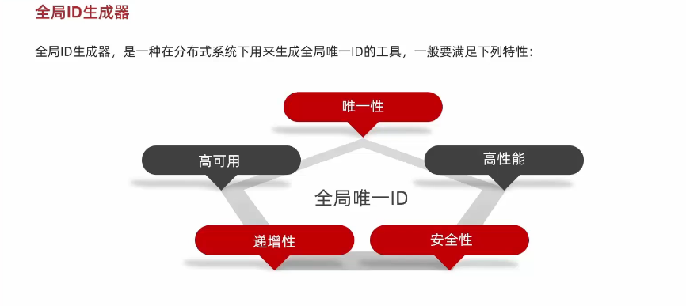

### 缓存更新策略
1. 内存淘汰，由redis的过期策略来更新缓存，缓存过期后，下次访问时，从数据库中获取数据，然后更新缓存
2. 主动更新，由应用程序来更新缓存，应用程序定时更新缓存，或者应用程序在更新数据库时，更新缓存
    1. 缓存调用者去更新缓存
    2. 缓存和数据库整合为一个服务，由服务来进行维护一致性

   
    3. 调用者只操作缓存，由其他线程异步去将缓存数据持久化到数据库
3. 超时剔除

### 缓存穿透
缓存穿透是指查询一个一定不存在的数据，由于缓存是不命中时才会去数据库查询，所以不存在的数据会一直去数据库查询，导致数据库压力过大。
常用的解决方案：
1. 布隆过滤器，将所有可能存在的数据哈希到一个足够大的bitmap中，一个一定不存在的数据会被这个bitmap拦截掉，从而避免了对底层存储系统的查询压力。
   1. 优点：内存占用少
   2. 缺点：有一定的误判率和删除困难
2. 缓存空对象，当缓存中没有数据时，将空对象缓存起来，下次查询时，直接返回空对象，避免了对底层存储系统的查询压力。
   1. 缓存空对象时，需要设置一个过期时间，防止缓存雪崩。
   2. 可能会造成短期的不一致。

### 缓存雪崩
缓存雪崩是指缓存中的数据在同一时间过期或者redis服务宕机，导致大量的请求直接打到数据库上，造成数据库压力过大。
常用的解决方案：
1. 设置不同的过期时间，防止缓存同时过期
2. 设置热点数据永不过期
3. 限流降级，当缓存失效时，限制对数据库的访问，降低数据库的压力
4. 服务降级，当缓存失效时，直接返回空对象，避免了对底层存储系统的查询压力。
5. 给业务增加多级缓存，当缓存失效时，先从二级缓存中获取数据，如果二级缓存中没有数据，再从数据库中获取数据，然后更新缓存。

### 缓存击穿
缓存击穿问题也叫热点key问题，就是一个被高并发访问并且缓存重建业务较复杂的key突然失效了，无数的请求访问这个key，都会去数据库中查询，造成数据库压力过大。
常用的解决方案：
1. 互斥锁，当缓存失效时，加锁，防止多个线程同时去数据库中查询数据，然后更新缓存。
   1. 性能差，大部分线程均需要等待一个线程去数据库中查询数据，然后更新缓存。
2. 逻辑过期时间，当缓存失效时，设置一个逻辑过期时间，当逻辑过期时间到达时，再去数据库中查询数据，然后更新缓存。
   

### 全局唯一ID
1. 数据库自增ID
   - ID规律性强，容易被猜测
   - ID长度受限于数据库字段类型
2. 全局ID生成器
   - 优点：ID长度不受限于数据库字段类型，ID规律性弱

   格式如下:
   
### 超卖等线程安全问题解决方案
1. 悲观锁：添加同步锁，让线程串行执行
 - 优点：简单粗暴
 - 缺点：性能差，大部分线程均需要等待一个线程执行完毕
2. 乐观锁：使用CAS算法，让线程并行执行，在更新时候判断是否有其他线程在修改数据，如果有则重试，直到成功为止
 - 优点：性能好
 - 缺点：重试次数过多，会影响性能（可以通过判断库存是否大于0来减少重试次数）